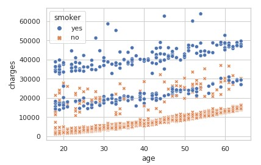

## This is a simple app that predict the medical cost in this haphazard time and provide a user a small relief. This project is done on the indian dataset so it shows the result in indian currency.
**Here is the app link**:[Medical cost predictor](https://medical-cost-finder.herokuapp.com)

# This is the final Result
- 

# Medical-cost-prediction

# Dataset
- We have a **Indian** dataset that contains information about people who had to pay for **medical assistance or surgeries**. It contains some of the **Charecterstics** of these     people like **sex, if they are a smoker etc**.
- We will be using this dataset to **predict** the cost of medical assistance a person has to pay.

# Data cleaning and preprocessing
- These are the steps I have performeed to clean the data
- 
- 
- 
- 
- 
- 
- To process the text data **Label Encoder** has been used.
- 

# Algorithm Used
- **Random Forest Gives Test Accuracy of -->> 83%**

# This is how you can install this app in your local machine
1. Create a project directory
2. Build an environment for the project in the directory.
3. set the mysite directory inside the above created directory.
4. run the command: pip install -r requirements.txt
5. run the command, inside the mysite directory in console: python manage.py migrate
6. run the command in same directory: python manage.py runserver
- django-admin startproject <name_of_project>
- python manage.py startapp <name_of_app>
